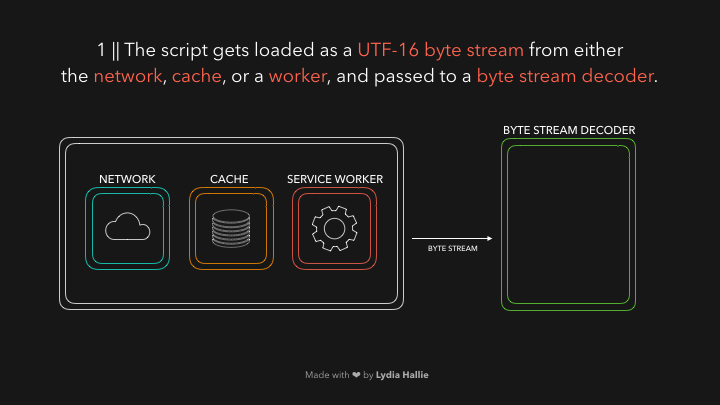
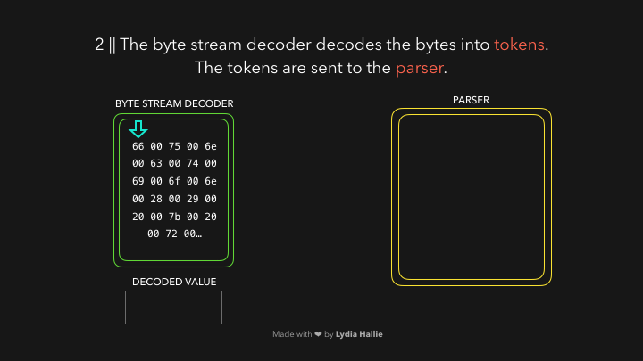
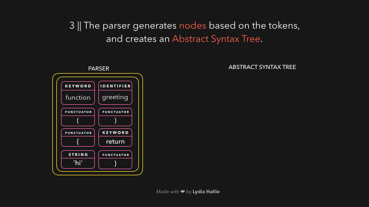
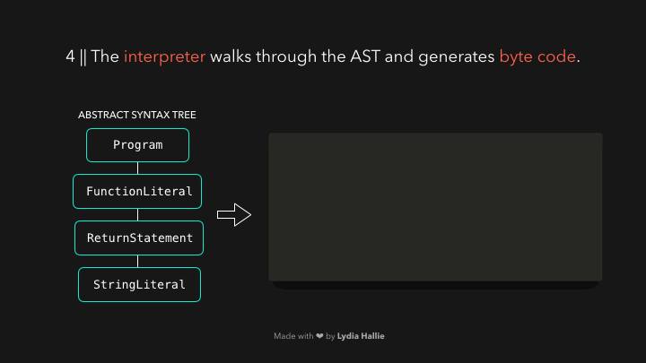
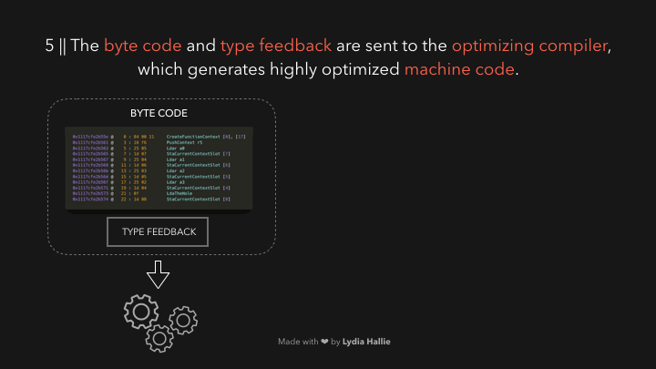

# como se ejecuta un script

1. carga del script

2. se parsea en tokens

3. El parser genera los nodos y arma el AST 

4. el interprete genera el byte code a partir del AST

5. se trata de optimizar el byte code a partir del compilador de optimizaciones, el cual genera machine code. 

