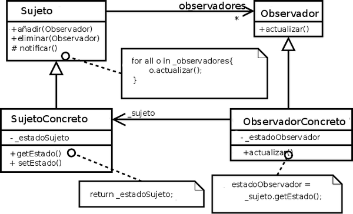

# ¿Cómo funciona el Patrón Observer?

El patrón `observer` se compone de un sujeto que ofrece mecanismos de `suscripción` y `desuscripción` a múltiples observadores que quieren ser notificados de los cambios en dicho sujeto. 

Cada `observador` expone un método de `update` que es usado por el sujeto para notificar cualquier cambio a todos los suscritos.

Es uno de los patrones más utilizados, algunos ejemplos típicos son:

- Newsletter
- Sockets
- Listeners en páginas web

