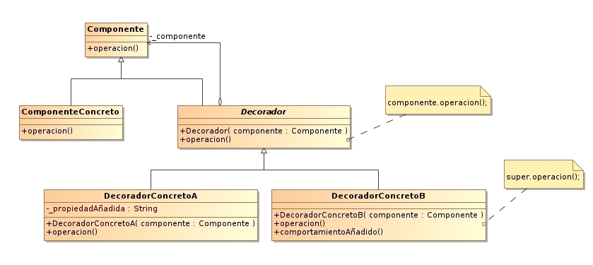
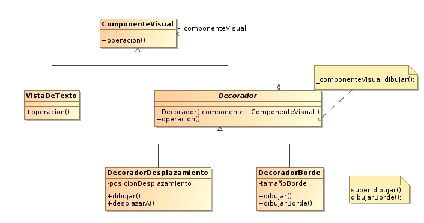

# Decorator

Es un patron de diseño Estructural y responde a la necesidad de **añadir dinámicamente funcionalidad a un Objeto** permitiendo extender su funcionalidad sin la necesidad de tener subclases.
Esto nos permite no tener que crear sucesivas clases que hereden de la primera incorporando la nueva funcionalidad, sino otras que la implementan y se asocian a la primera.





## especie de decorator en JS

```js
// tenemos una clase, MacbookPro que segun la cantidad de memoria cambia el precio

let macbook = new MacbookPro();

withMemory(32, macbook);

console.log(mackbook, cost());
// 2999
```

la implementacion

```js
//clase base con memoria de 8 y costo de 2399
class MacbookPro {
  constructor() {
    this.memory = 8;
  }
  cost() {
    return 2399;
  }
}

// decorador, segun la memoria que se le pasa, cambia el precio de la instancia de la computadora
function withMemory(ram, computer) {
  let cost = computer.cost();

  computer.cost = function () {
    let memoryCost = Math.max((ram - 8) * 25, 0);
    return cost + memoryCost;
  };
}
```
