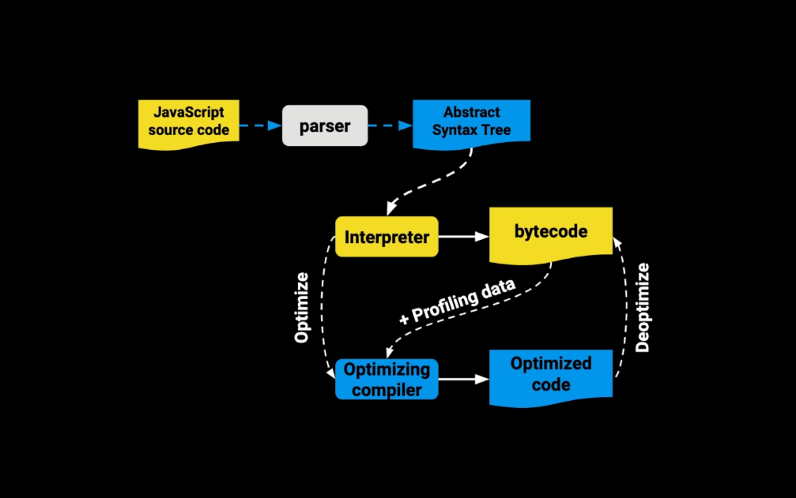

# como funciona JS

## Parsers y el Abstract Syntax Tree (AST)

El JS Engine recibe el código fuente y lo procesa de la siguiente manera:

- El parser descompone y crea tokens que integran el AST.
- Se compila a bytecode y se ejecuta.
- Lo que se pueda se optimiza a machine code y se reemplaza el código base.

Un `SyntaxError` es lanzado cuando el motor JavaScript encuentra partes que no forman parte de la sintaxis del lenguaje y esto lo logra gracias a que se tiene un AST generado por el parser.

Segun google 

> El parser es del 15% al 20% del proceso de ejecución por lo que hay que usar parser del código justo en el momento que lo necesitamos y no antes de saber si se va a usar o no.

> la mayoria del JS en una pagina nunca se ejecuta

> el bundlig y code splitting es muy importante

### que hace el parser

basicamente agarra el codigo fuente y lo descompone en tokens, y crea el `Abstract Syntax Tree` 

### Parsers de V8

#### Eager Parsing

- Encuentra errores de sintaxis
- crea el AST
- Construye Scopes
  
#### Lazy Parsing

- Doble de rapido que el Eager
- No crea el AST
- Construye Scopes Parcialmente

### Abstract Syntax Tree AST

Es un grafo (estructura de datos) que representa un programa

se usa en:

- JS Engine
- Bundlers: Webpack, Rollup, Parcel
- Transpilers: Babel
- Linters: ESLint, Prettier
- Type Checkers: TypeScript, Flow
- Syntax Highligthers